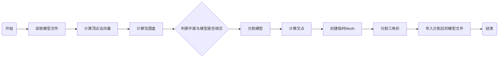

## 3DSplit
  


## 简介
基于Open3D对 obj模型进行拆分, 并保留原始UV坐标 
```none
┌────────────────────────────────┐
│   open3d::io::ReadTriangleMesh │
└───────────────┬────────────────┘    
                │  
┌───────────────▼──────────────────┐
│   BoundingBox Plane Intersect    │
└───────────────┬──────────────────┘ 
                │
┌───────────────▼──────────────────┐
│     Line Plane Intersect         │
└───────┬────────────────────┬─────┘ 
        │                    │        
┌───────▼──────┐    ┌────────▼───────┐
│UV / vertices │    │  UV / vertices │
│   triangle   │    │   triangle     │
│   new Mesh   │    │   new Mesh     │
└───────┬──────┘    └─────────┬──────┘
        │                     │     
┌───────▼─────────────────────▼──────┐
│                                    │
│ open3d::io::WriteTriangleMeshToOBJ │
│                                    │
└────────────────────────────────────┘


```




### 编译
```
$ git clone https://github.com/LiuKaoji/3DSplit.git
$ cd 3DSplit
$ chmod +x init.sh
$ ./init.sh
```


## 参考
```bash
https://gdbooks.gitbooks.io/3dcollisions/content/Chapter2/static_aabb_plane.html
```


